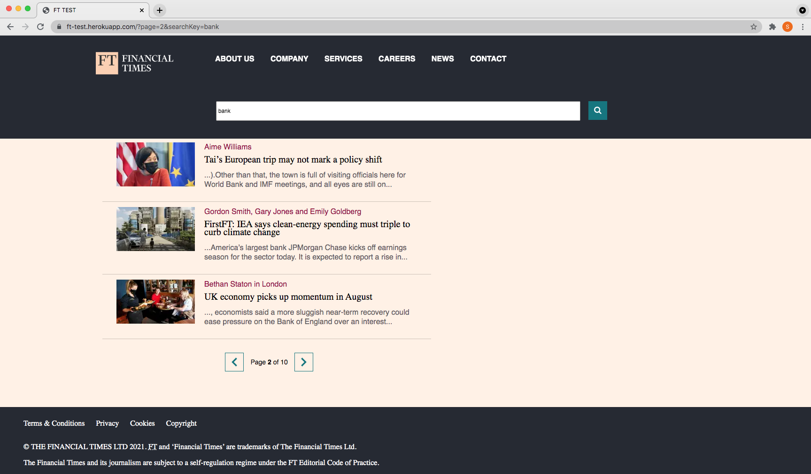

# FT-TEST

<a href="https://ft-test.herokuapp.com">FT-TEST</a> is a  Node.js app for displaying headlines from Financial Times.


<!-- TABLE OF CONTENTS -->
<details>
  <summary>Table of Contents</summary>
  <ol>
    <li>
      <a href="#about-the-project">About The Project</a>
      <ul>
        <li><a href="#Data flow">Data flow</a></li>
        <li><a href="#Technologies">Technologies</a></li>
      </ul>
    </li>
    <li>
      <a href="#getting-started">Getting Started</a>
      <ul>
        <li><a href="#installation">Installation</a></li>
      </ul>
    </li>
    <li><a href="#usage">Usage</a></li>
    <li><a href="#contact">Contact</a></li>
    <li><a href="#Sources">Sources</a></li>
    <li><a href="#Task points">Task points</a></li>
    <li><a href="#In future ">In future </a></li>
  </ol>
</details>


<!-- ABOUT THE PROJECT -->
## About The Project



 This project shows 15 headlines in every page.  

* There is a search box for user to search for headlines containing specific words.
* The App has paginiation and user can to click on Next or Previous buttons to navigate between pages.
* Every headline has link to open the details page.

### Data flow

1. The user requests the homepage (https://ft-test.herokuapp.com)
2. The server fetches the search results from the FT api and returns the rendered page to the client, caching the results for pagination
3. The headlines are sliced for the first page and calculate pages count based on per page count.
4. By clicking the "Next" or "Previous" button, display the next or last slice of headlines.
5. If the user enter words in the search box and click search icon, the steps 2 and 3 will run again.


<p align="right">(<a href="#top">back to top</a>)</p>


### Technologies


* [HTML](https://html.com/)
* [CSS](https://www.codecademy.com/learn/learn-css)
* [JavaScript](https://javascript.info/)
* [Node.js](https://nodejs.org/en/)
* [Express](https://expressjs.com/)
* [Handlebars](https://handlebarsjs.com/)
* [Jest](https://jestjs.io/)

<p align="right">(<a href="#top">back to top</a>)</p>


<!-- GETTING STARTED -->
## Getting Started
 
 

### Installation

1. Get  FT APIs Key at [https://developer.ft.com/portal/services](https://developer.ft.com/portal/services)

2. Clone the repo
   ```sh
   git clone https://github.com/DibaKarimi/FT-TEST
   ```
3. Install NPM packages
   ```sh
   npm install
   ```
4. env file would be
   ```js
   const API_URL = 'ENTER YOUR API URL';
   ```
5. env file would be
   ```js
   const API_KEY = 'ENTER YOUR API KEY';
   ```
<p align="right">(<a href="#top">back to top</a>)</p>


<!-- USAGE EXAMPLES -->
## Usage

After running the app in localhost, open 'localhost:3000'.
You will see headlines on the main part of the page and pagination bar at the bottom of the headlines.
It will show 15 headlines by default. Enter a specific words in search input box and then click on the search button,
it will show the headlines related to the search keyword. If there are more than 15 headlines,they are divided in pages,
you are be able change the page by clicking on the next or previous buttons.


<p align="right">(<a href="#top">back to top</a>)</p>


<!-- CONTACT -->
## Contact

Diba(somayeh) Karimi - Dibaakarimi@gmail.com

Project Link: [https://github.com/DibaKarimi/FT-TEST](https://github.com/DibaKarimi/FT-TEST)

## Sources

 - This project was inspired by 
 - https://github.com/ChristianHur/152-150-Web-Programming-2
 - https://www.youtube.com/watch?v=ZX3qt0UWifc
 - https://www.youtube.com/watch?v=FgnxcUQ5vho

<p align="right">(<a href="#top">back to top</a>)</p>

## Task points

The project has been built to 
- Display headlines from the Financial Times
- Provide search box to search for headlines contaning specific words
- Be responsive
- be accessible
- Have pagination
- using Javascript and node.js
- Deployed on Heroku
- have a similar look and feel as ft.com
- Have unit test

## In future 


- use Origami components to design the page
- Work offline 
- Progressively enhanced


<!-- MARKDOWN LINKS & IMAGES -->
<!-- https://www.markdownguide.org/basic-syntax/#reference-style-links -->
[contributors-shield]: https://img.shields.io/github/contributors/othneildrew/Best-README-Template.svg?style=for-the-badge
[contributors-url]: https://github.com/othneildrew/Best-README-Template/graphs/contributors
[forks-shield]: https://img.shields.io/github/forks/othneildrew/Best-README-Template.svg?style=for-the-badge
[forks-url]: https://github.com/othneildrew/Best-README-Template/network/members
[stars-shield]: https://img.shields.io/github/stars/othneildrew/Best-README-Template.svg?style=for-the-badge
[stars-url]: https://github.com/othneildrew/Best-README-Template/stargazers
[issues-shield]: https://img.shields.io/github/issues/othneildrew/Best-README-Template.svg?style=for-the-badge
[issues-url]: https://github.com/othneildrew/Best-README-Template/issues
[license-shield]: https://img.shields.io/github/license/othneildrew/Best-README-Template.svg?style=for-the-badge
[license-url]: https://github.com/othneildrew/Best-README-Template/blob/master/LICENSE.txt
[linkedin-shield]: https://img.shields.io/badge/-LinkedIn-black.svg?style=for-the-badge&logo=linkedin&colorB=555
[linkedin-url]: https://linkedin.com/in/othneildrew
[product-screenshot]: images/screenshot.png
